# PROYECTO FINAL

## PROCESADOR RISC-V

### SANTILLÁN ATILIO EMANUEL

### INGENIERÍA ELECTRÓNICA

### 2025

---
<div style="page-break-after: always;"></div>

## 1. RESUMEN

En este informe se presenta el diseño y la descripción de hardware en VHDL de un microcontrolador multiciclo basado en la arquitectura RISC-V. El sistema está compuesto por una CPU capaz de ejecutar el conjunto básico de instrucciones RV32I, una memoria RAM y un controlador de periféricos (GPIO). Además de exponer las simulaciones de validación del datapath y la unidad de control, se destaca la ejecución de un juego interactivo en lenguaje C como prueba integradora. Finalmente, se detalla la síntesis y carga exitosa del sistema completo en la placa física EDU-CIAA-FPGA, comprobando su funcionamiento en hardware real.

---
<div style="page-break-after: always;"></div>

## 2. INTRODUCCIÓN

### 2.1 Arquitectura de computadora

El término "arquitectura de computadora" (o ISA - Instruction Set Architecture) se refiere a la visión abstracta del sistema desde la perspectiva del programador. Define la interfaz entre el hardware y el software, especificando los tipos de datos soportados, el conjunto de registros, los modos de direccionamiento y el conjunto de instrucciones disponibles, sin entrar en detalles de cómo estos se implementan físicamente (lo cual corresponde a la microarquitectura). (Harris & Harris, 2019).

### 2.2 Microarquitectura

La microarquitectura de computadoras incluye todo el hardware involucrado en el funcionamiento de una computadora. Está definida por el arreglo de registros, memorias, unidades aritmético-lógicas (ALUs), y otro bloques constructivos del microprocesador.
La microarquitectura se divide en 2 partes que interactúan entre si: el datapath y la unidad de control. El datapath contiene las memorias, ALUs, registros y multiplexores. Como trabajamos con RV32I, el datapath es de 32 bits. La unidad de control recibe la instrucción actual y le indica al datapath como ejecutarla (Harris & Harris, 2019).
Para el diseño de una microarquitectura, primero deben definirse los elementos de estado. Nos centraremos en 4 elementos de estado: el program counter (PC), el register file, memoria de instrucción y memoria de información.

<u>Program counter:</u> es un puntero a la dirección de instrucción actual. Su entrada (PCNext) indica la dirección de la siguiente instrucción.

<u>Memoria de instrucción:</u> es una memoria simple de solo lectura. Toma la dirección de 32 bits proporcionada por PC y lee la instrucción que contiene (de 32 bits también).

<u>Conjunto de registros:</u> es una memoria multi puerto de 32x32 bits. Tiene dos puertos de lectura A1 Y A2, uno de escritura A3 de 5 bits (pues hay solo 32 registros). Además cuenta con una entrada de datos de 32 bits WD, y cuenta con habilitación de escritura WE sincrónica. La salida de lectura es de 32 bits.

<u>Memoria de datos:</u> memoria de lectura escritura con habilitación de escritura sincrónica. Las direcciones A, y las palabras a escribir WD o leer RD son de 32 bits.

En la **Imagen 2.2** se observa el símbolo de estos elementos.

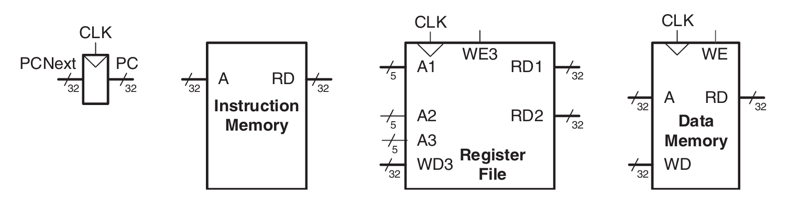

**Imagen 2.2** *Elementos de estado*

_Nota. Adaptado de Digital Design and Computer Architecture, por D. M. Harris y S. L. Harris, 2019_

#### 2.2.1 Tipos de Microarquitectura RISC-V

Según Harris & Harris, (2019), existen diversas formas de conectar los elementos de estado y la lógica para implementar el conjunto de instrucciones RISC-V. Las tres variantes principales son:

**Procesador Uniciclo (Single-Cycle):** Ejecuta la instrucción completa en un único ciclo de reloj. Aunque su lógica de control es simple y no requiere registros intermedios, tiene dos grandes desventajas: el periodo del reloj está limitado por la instrucción más lenta (como lw), y requiere memorias separadas para instrucciones y datos, lo cual es costoso y poco realista para sistemas simples.

**Procesador Segmentado (Pipelined):** Divide la ejecución en varias etapas que funcionan en paralelo, permitiendo ejecutar múltiples instrucciones simultáneamente. Esto mejora drásticamente el rendimiento, pero requiere hardware adicional para gestionar dependencias de datos y registros de segmentación. Es el estándar en procesadores comerciales modernos.

**Procesador Multiciclo (Multicycle):** Esta arquitectura ejecuta una instrucción a lo largo de una serie de ciclos más cortos. Sus ventajas principales, y la razón por la que se implementará en este proyecto, son:

- Reutilización de Hardware: Permite usar unidades costosas (como la ALU o sumadores) varias veces dentro de la misma instrucción para distintos propósitos.

- Memoria Única: A diferencia del uniciclo, puede utilizar una sola interfaz de memoria tanto para leer instrucciones (fetch) como para leer/escribir datos, accediendo a ella en ciclos diferentes.

- Eficiencia: Las instrucciones simples toman menos ciclos que las complejas.

Para implementar este diseño, el datapath debe incorporar elementos de estado no arquitectónicos adicionales para almacenar los resultados intermedios entre cada paso. Asimismo, dado que se generan señales de control diferentes en cada paso de una misma instrucción, el controlador debe implementarse mediante una Máquina de Estados Finitos (FSM).

---
<div style="page-break-after: always;"></div>

## 3. DESARROLLO

### 3.1 Arquitectura RISC-V 

Según Harris & Harris (2019), la arquitectura RISC-V se introduce como la primera arquitectura de conjunto de instrucciones (ISA) de código abierto que cuenta con un amplio soporte comercial. Fue definida inicialmente en el año 2010 en la Universidad de California, Berkeley, por Krste Asanović, Andrew Waterman y David Patterson, entre otros.

Una característica inusual de RISC-V es que su naturaleza de código abierto la hace de uso gratuito, manteniendo capacidades comparables a arquitecturas comerciales establecidas como ARM y x86. El diseño de esta arquitectura se basó en cuatro principios fundamentales: (1) la regularidad apoya la simplicidad; (2) hacer rápido el caso común; (3) lo más pequeño es más rápido; y (4) el buen diseño exige buenos compromisos.

Con respecto al RV32I, se describe como el conjunto de instrucciones de enteros de 32 bits (versión 2.2). Este conjunto es fundamental, ya que forma el núcleo (core) del conjunto de instrucciones de RISC-V. 

### 3.2 Conjunto de registros de la arquitectura RISC-V

La arquitectura RISC-V cuenta con 32 registros (ancho de palabra de 32 bits) llamada register set, almacenados en una pequeña memoria multi puerto llamada register file. Al tener pocos registros se obtiene una gran velocidad de acceso. Estos registros están numerados del 0 al 31 y tienen nombres y propósitos específicos. En la **Imagen 3.2** se observa la distribución de los registros:

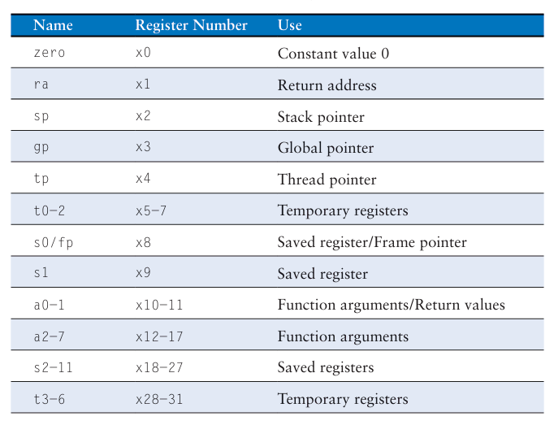

**Imagen 3.2** *Conjunto de registros RISC-V*

_Nota. Adaptado de Digital Design and Computer Architecture, por D. M. Harris y S. L. Harris, 2019_

Aunque la mayoría de registros son de propósito general, la arquitectura impone funciones específicas en hardware y convenciones de software (ABI) para algunos de ellos:

x0 (Zero): Este registro está cableado permanentemente al valor 0. Cualquier escritura en él es ignorada y cualquier lectura devuelve siempre 0. Esto simplifica el conjunto de instrucciones (por ejemplo, para mover datos se usa una suma con 0).

x1 (ra): Por convención, actúa como el Return Address Register, almacenando la dirección de retorno al llamar a subrutinas.

x2 (sp): Actúa como Stack Pointer (puntero de pila).

### 3.3 Conjunto de instrucciones RV32I

#### 3.3.1 Instrucciones tipo R

Las instrucciones tipo R (register-type) usan 3 registros como operando, dos como fuente (rs1 y rs2) y uno de destino rd. Cada campo de registro ocupa 5 bits, permitiendo direccionar cualquiera de los 32 registros del banco (x0-x31). En lenguaje máquina, las instrucciones R tienen el siguiente formato (**Imagen 3.3.1**).

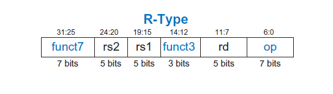

**Imagen 3.3.1** *Formato instrucciones R*

_Nota. Adaptado de Digital Design and Computer Architecture, por D. M. Harris y S. L. Harris, 2019_

Los campos **funct7 (7 bits), funct3 (3 bits) y opcode (7 bits)** son llamados bits de control y especifican la operación exacta a ejecutar. Por ejemplo, _add y sub_ comparten el mismo _opcode y funct3_, diferenciándose únicamente en el _funct7_.

Las instrucciones R incluyen operaciones aritméticas (add, sub), lógicas (and, or y xor) y desplazamientos (sll, srl y sra), sin utilizar valores inmediatos, solo datos contenidos en registros.

#### 3.3.2 Instrucciones tipo I

Las instrucciones tipo I (immediate-type) usan 2 registros como operando (uno como fuente (rs1) y uno de destino rd) y un operando de valor inmediato de 12 bits. En lenguaje maquina, las instrucciones I tienen el siguiente formato (**Imagen 3.3.2**).

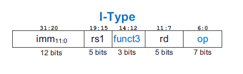

**Imagen 3.3.2** *Formato instrucciones I*

_Nota. Adaptado de Digital Design and Computer Architecture, por D. M. Harris y S. L. Harris, 2019_

Las instrucciones I incluyen operaciones aritméticas (addi), lógicas (andi, ori y xori) y desplazamientos (slli, srli y srai), utilizando valores inmediatos. Para la mayoría de operaciones el campo inmediato representa un número de 12 bits en complemento a 2, excepto para los desplazamientos. En esos casos, imm 4:0 es el desplazamiento de 5 bits sin signo a realizar, y los 7 bits superiores son 0, excepto en srai, donde imm10 vale 1 (Harris & Harris, 2019)..

#### 3.3.3 Instrucciones tipo S

Las instrucciones tipo S (store-type) se utilizan para escribir datos desde un registro hacia la memoria. A diferencia de las instrucciones tipo R o I, este formato no posee un registro de destino (rd), ya que el objetivo es enviar información a la RAM y no guardar un resultado en el conjunto de registros.

En su lugar, utilizan dos registros fuente: _rs1_ (que contiene la dirección base de memoria) y _rs2_ (que contiene el dato a almacenar). Además, emplean un valor inmediato de 12 bits con signo (complemento a 2) que actúa como desplazamiento (offset).

En lenguaje máquina, las instrucciones S tienen el siguiente formato (**Imagen 3.3.3**).

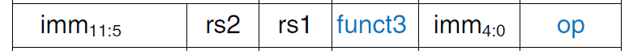

**Imagen 3.3.3** *Formato instrucciones S*

_Nota. Adaptado de Digital Design and Computer Architecture, por D. M. Harris y S. L. Harris, 2019_

Para mantener la posición de los campos rs1 y rs2 alineada con los otros formatos, el inmediato de 12 bits se divide en dos partes dentro de la instrucción.

El opcode para todas las instrucciones de almacenamiento es 0100011, y el campo funct3 determina el ancho del dato a guardar: sb (byte), sh (media palabra) o sw (palabra completa).

#### 3.3.4 Instrucciones tipo B

Las instrucciones tipo B (branch-type) manejan los saltos condicionales (como beq, bne, blt). Estructuralmente son muy similares al tipo S: utilizan dos registros fuente (rs1 y rs2) que se comparan para decidir si se toma el salto o no, y un inmediato que indica el destino del salto.

En lenguaje máquina, las instrucciones B tienen el siguiente formato (**Imagen 3.3.4**).

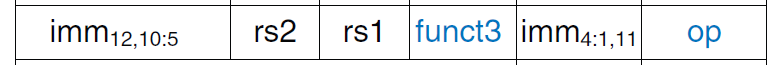

**Imagen 3.3.4** *Formato instrucciones B*

_Nota. Adaptado de Digital Design and Computer Architecture, por D. M. Harris y S. L. Harris, 2019_

La principal diferencia radica en la codificación del inmediato. En las instrucciones de salto, el inmediato representa un desplazamiento de 13 bits con signo. Sin embargo, como las instrucciones en RISC-V siempre están alineadas a direcciones pares, el bit menos significativo (bit 0) es siempre 0 y no se almacena en la instrucción. Esto permite codificar un rango efectivo de 13 bits usando solo 12 bits de espacio.

Además, los bits del inmediato se encuentran "desordenados" dentro de la instrucción (bit swizzling). Este re ordenamiento aparente se realiza para que el bit de signo siempre ocupe la posición 31 (igual que en los tipos R, I y S) y para que los otros bits coincidan lo máximo posible con el formato S, simplificando así el hardware de decodificación. (Harris & Harris, 2019).

#### 3.3.5 Instrucciones tipo U

Las instrucciones tipo U (*upper immediate*) poseen un operando de registro de destino rd, un campo inmediato de 20 bits y un opcode de 7 bits. Los bits restantes especifican los 20 bits más significativos de un inmediato de 32 bits.

En lenguaje máquina, las instrucciones U tienen el siguiente formato (**Imagen 3.3.5**).


**Imagen 3.3.5** *Formato instrucciones U*

_Nota. Adaptado de Digital Design and Computer Architecture, por D. M. Harris y S. L. Harris, 2019_

La instrucción lui (*load upper *immediate) es un ejemplo de este formato. El inmediato de 32 bits resultante consiste en los 20 bits superiores codificados en la instrucción y ceros en los bits inferiores. Por ejemplo, tras la ejecución, el registro de destino podría contener un valor como 0x8CDEF000 donde la parte alta proviene del inmediato.
Además de lui, existe la instrucción auipc (Add Upper Immediate to PC). Esta suma el inmediato de 20 bits (desplazado 12 bits a la izquierda) al PC actual. Sirve para generar direcciones de memoria relativas a la posición actual. (Harris & Harris, 2019).

#### 3.3.6 Instrucciones tipo J

Las instrucciones tipo J también poseen un registro de destino rd y un campo inmediato de 20 bits, pero en este caso, dichos bits especifican los 20 bits más significativos de un desplazamiento de salto (jump offset) de 21 bits.

En lenguaje máquina, las instrucciones J tienen el siguiente formato (**Imagen 3.3.6**).

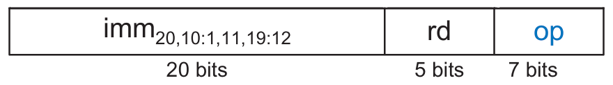

**Imagen 3.3.6** *Formato instrucciones J*

_Nota. Adaptado de Digital Design and Computer Architecture, por D. M. Harris y S. L. Harris, 2019_

Al igual que en las instrucciones tipo B, el bit menos significativo del inmediato es siempre 0 y no se codifica en la instrucción. Los bits restantes se encuentran mezclados (swizzled) dentro del campo inmediato de 20 bits.

La instrucción jal (*jump and link*) realiza un salto a una dirección relativa al PC actual (la dirección de la propia instrucción jal). Si la instrucción en ensamblador no especifica un registro de destino rd, este campo asume por defecto el valor de ra (x1). Asimismo, el salto ordinario (j) se codifica como una instrucción jal con rd = 0. (Harris & Harris, 2019).

#### 3.3.7 Codificación de valores inmediatos

RISC-V utiliza valores inmediatos de 32 bits con signo (complemento a 2). Sin embargo, debido a las restricciones de tamaño de la instrucción, solo se codifican entre 12 y 21 bits del inmediato dentro de la instrucción misma. (Harris & Harris, 2019).

Como se observa en la distribución de formatos (**Imagen 3.3.7**):

Tipos I y S: Codifican inmediatos de 12 bits con signo.

Tipos J y B: Utilizan inmediatos de 21 y 13 bits con signo respectivamente, donde el bit menos significativo es siempre 0.

Tipo U: Codifica los 20 bits superiores de un inmediato de 32 bits. Los 12 bits menos significativos valen 0.

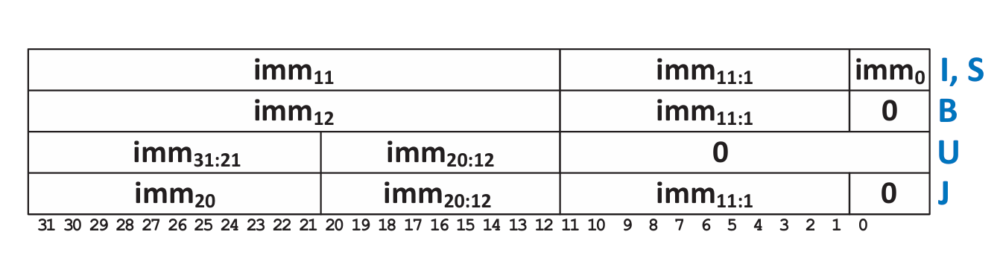

**Imagen 3.3.7** *RISC-V Inmediatos*

_Nota. Adaptado de Digital Design and Computer Architecture, por D. M. Harris y S. L. Harris, 2019_

El diseño de RV32I prioriza la regularidad para simplificar el hardware. A través de los diferentes formatos, se intenta mantener los bits del inmediato en las mismas posiciones de la instrucción tanto como sea posible. Esta consistencia minimiza la cantidad de cables y multiplexores necesarios para extraer y extender el signo del inmediato, aunque esto conlleve una codificación de instrucción más compleja (conocida como bit swizzling). Por ejemplo, el bit 31 de la instrucción siempre contiene el bit de signo del inmediato. 

#### 3.3.8 Análisis de la Codificación de Operaciones (Opcodes 19, 51 y 99)

Analizando la tabla del conjunto de instrucciones RV32I, es posible determinar cómo el procesador "sabe" qué operación matemática debe realizar la ALU basándose únicamente en los bits de la instrucción.

**1. Operaciones Aritmético-Lógicas (Opcodes 19 y 51):**

Al comparar las instrucciones de tipo R *(Opcode 51 - 0110011)* con las de tipo I *(Opcode 19 - 0010011)*, se observa un patrón idéntico en el campo **funct3**:

Para sumar *(add y addi)*, el **funct3** es 000.

Para la operación AND *(and y andi)*, el **funct3** es 111.

Para la operación OR (or y ori), el funct3 es 110.

La operación matemática de la ALU se codifica principalmente en los 3 bits del campo funct3. El opcode (19 o 51) solamente le indica al procesador si el segundo número para operar proviene de un registro o es un valor inmediato, pero la operación de cálculo (suma, and, or) es la misma.

**2. Saltos Condicionales (Opcode 99):**

Las instrucciones de salto (beq, bne) tienen el opcode 99 (1100011).

Matemáticamente, para comparar si dos números son iguales (beq), el procesador debe restarlos. Si el resultado de la resta es cero, los números son iguales. Por lo tanto, aunque la instrucción sea de "salto", la ALU realiza una resta.

La condición de salto es el resultado de esa resta. El campo funct3 codifica qué condición buscar:

    000 (beq): Salta si el resultado es Cero.

    001 (bne): Salta si el resultado no es Cero. 

---
<div style="page-break-after: always;"></div>

## 4. RESULTADOS

Se presenta el diseño y desarrollo de la descripción de hardware (utilizando el estándar VHDL-2008) de un sistema microcontrolador conformado por un procesador multiciclo con arquitectura RISC-V, capaz de ejecutar el conjunto básico de instrucciones de enteros RV32I. El sistema integra además una memoria RAM de 512x32 y una interfaz periférica con 8 bits de entrada y 8 bits de salida. En esta sección también se exponen los resultados de las simulaciones de validación, realizadas a través de testbenchs descritos en VHDL.

### 4.1 Diseño Macro

Para interconectar los elementos principales del sistema (procesador, memoria RAM e interfaz periférica), se implementó un crossbar. Este componente actúa como un bus compartido que, basándose en la dirección de memoria solicitada por el procesador, rutea las señales para permitir la lectura o escritura del esclavo correspondiente, garantizando que el acceso sea mutuamente excluyente. Para el mapa de memoria, se asignó la dirección base x"00000000" a la memoria RAM y la dirección x"40000000" a la interfaz periférica. En la **Imagen 4.1** se observa la manera en que se interconectan los módulos mencionados.


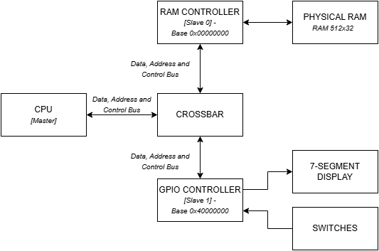

**Imagen 4.1** *Diseño TOP Level*

### 4.2 Datapath

En la **Imagen 4.2** se observa el camino de datos con un nivel menor de abstracción. Este pertenece principalmente al módulo CPU, pero también se pueden observar algunas de las señales que se mandan al crossbar, para redirigirse al esclavo correspondiente.

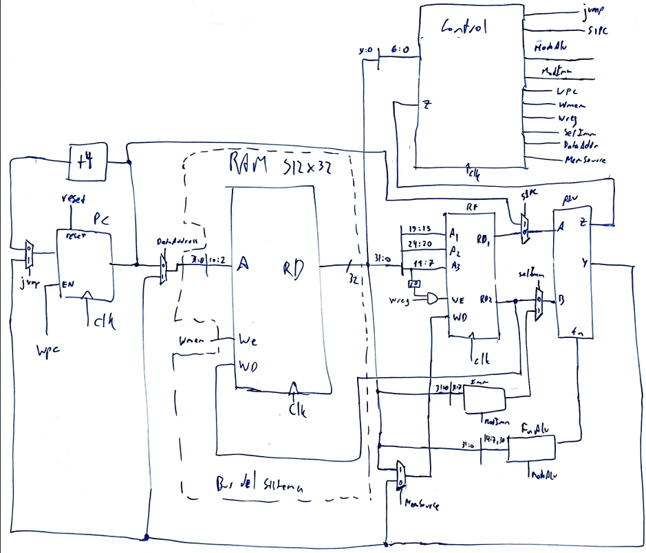

**Imagen 4.2** *Datapath*

#### 4.2.1 CPU

La descripción de hardware de la unidad central de procesamiento engloba la mayor parte del datapath y una Máquina de Estados Finitos (FSM) que actúa como unidad de control. Esta FSM es responsable de leer las instrucciones de la memoria y secuenciar las señales de control del datapath para su correcta ejecución. En la **Figura 4.2.1** se muestra el diagrama de estados de la FSM . Para este diseño se optó por una topología de máquina de Mealy, dado que en ciertas transiciones, el cambio de estado y las salidas dependen no solo del estado actual, sino también del valor de las entradas (como el opcode de la instrucción en curso).

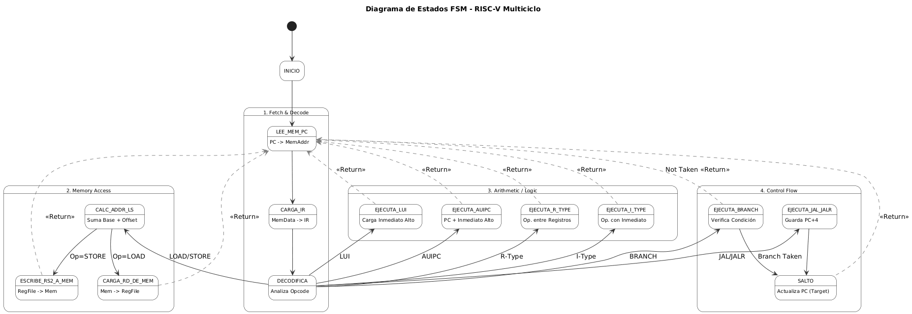

**Imagen 4.2.1** *Diagrama de estados*

#### 4.2.2 Crossbar

Este módulo actúa como el árbitro de las comunicaciones, interconectando la CPU (maestro) con el controlador de RAM y el controlador GPIO (esclavos). La interfaz de señales implicadas en el enrutamiento es la siguiente:

```vhdl
bus_maddr : in std_logic_vector(31 downto 0); -- direccion que envia el maestro
bus_mdms : in std_logic_vector (31 downto 0); -- datos que envia el maestro
bus_mtwidth : in std_logic_vector (2 downto 0); -- ancho de datos que envia el maestro
bus_mtms : in std_logic; -- señal de control que envia el maestro, que indica si hay datos válidos
bus_sact : in std_logic_vector (num_slaves - 1 downto 0); -- indica cuantos esclavos estan activos
bus_sdsm : in word_array(num_slaves - 1 downto 0); -- matriz que contiene los datos de cada esclavo
bus_mdsm : out std_logic_vector (31 downto 0); -- vector con los datos que le llegan de un esclavo
bus_saddr : out std_logic_vector (31 downto 0); -- direccion que se envia al esclavo. 
bus_sdms : out std_logic_vector (31 downto 0); -- datos que se envian al esclavo
bus_stwidth : out std_logic_vector (2 downto 0); -- ancho de datos que se envia al esclavo
bus_stms : out std_logic -- señal de control que se envia al esclavo, que indica si hay datos válidos
```

#### 4.2.3 RAM Controller

El crossbar se interconecta con la memoria RAM física a través del controlador de memoria (RAM Controller). Esta entidad recibe las peticiones provenientes de la CPU (dirección, habilitación de escritura, máscara de bytes y ancho de palabra) y, mediante una red de multiplexores y lógica combinacional, gestiona el acceso a la memoria para almacenar o recuperar la información requerida de manera sincrónica.

#### 4.2.4 GPIO Controller

Este módulo enlaza la CPU con la interfaz periférica externa, que en la implementación física corresponde a 8 interruptores (switches) y un display de 7 segmentos. Su función principal es adaptar el bus de datos de 32 bits del procesador a las limitaciones físicas de hardware, mapeando los datos a puertos de 8 bits de entrada y 8 bits de salida.

### 4.3 Simulaciones

Si bien se simularon la mayoría de componentes individualmente durante la etapa de desarrollo para verificar su comportamiento aislado, el presente análisis se centra en la integración del sistema a nivel top.

Para validar la funcionalidad global, la estrategia de simulación se dividió en dos etapas: pruebas con y sin el controlador GPIO. La primera etapa busca comprobar el correcto funcionamiento del procesador, analizando si es capaz de ejecutar las instrucciones que deseamos, y la correcta comunicación entre el procesador y memoria RAM a través del crossbar. La segunda etapa verifica si el controlador periférico se integra correctamente al conjunto anterior. Además, como prueba integradora final, se creo un juego interactivo en C.

#### 4.3.1 Validación inicial del Datapath y Memoria (Top sin I/O)

Para verificar el funcionamiento del núcleo del procesador y su interacción con la memoria RAM, se precargó un programa de prueba en lenguaje máquina. Este algoritmo calcula iterativamente la sumatoria de los primeros cinco números enteros (5 + 4 + 3 + 2 + 1 = 15).

``` asm
# Programa de Validación del Datapath (Sumatoria de 5)
# Arquitectura: RV32I
# Resultado esperado en memoria: 0x0F (15 en decimal)

# --- INICIALIZACIÓN ---
addi x1, x0, 5      # 0x00: 00500093 | x1 = 5  (Contador del bucle)
addi x2, x0, 0      # 0x04: 00000113 | x2 = 0  (Acumulador de suma)
addi x3, x0, -1     # 0x08: fff00193 | x3 = -1 (Constante para decrementar)

# --- BUCLE DE SUMA (LOOP) ---
add  x2, x2, x1     # 0x0C: 00110133 | Acumula: x2 = x2 + x1
add  x1, x1, x3     # 0x10: 003080b3 | Decrementa: x1 = x1 - 1
bne  x1, x0, -8     # 0x14: fe009ce3 | Si x1 != 0, salta -8 bytes (vuelve a 0x0C)

# --- ACCESO A MEMORIA Y FIN ---
sw   x2, 0(x0)      # 0x18: 00202023 | Almacena el resultado (15) en la dirección base de la RAM
lw   x4, 0(x0)      # 0x1C: 00002203 | Lee el valor de la RAM hacia x4 (valida lectura)
jal  x0, 0          # 0x20: 0000006f | Salto incondicional a sí mismo (Bucle infinito / Halt)

```

Se diseñó este código específicamente porque exige la ejecución de las principales familias de instrucciones RV32I: operaciones aritméticas (add, addi), saltos condicionales para el bucle (bne), operaciones de escritura/lectura en memoria (sw, lw) y saltos incondicionales (jal). 

Se realizó un test bench que solo deja correr el programa el suficiente tiempo para que termine, para luego analizar las formas de onda obtenidas. Para facilitar la lectura, se colocó el formato en decimal con signo. En la **Imagen 4.3.1** se observa que el resultado 15, se almacenó correctamente en la dirección 0 de la RAM, reemplazando la instrucción que contenía previamente, y luego lo escribe en rs4.  Adicionalmente, se analizó la transición de estados para la instrucción: lw   x4, 0(x0). En la **Imagen 4.3.2** se comprueba que dicho pasaje coincide perfectamente con el previsto  por el diagrama de estados diseñado.  Por lo tanto, se valida de forma integral que la unidad de control, el datapath y el controlador de memoria operan correctamente en conjunto


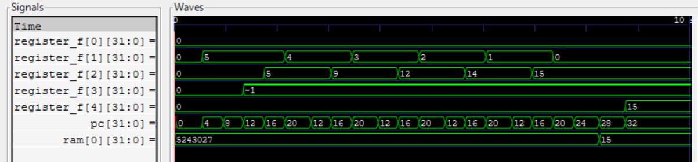

**Imagen 4.3.1** *Formas de onda: comprobación de funcionamiento del programa*


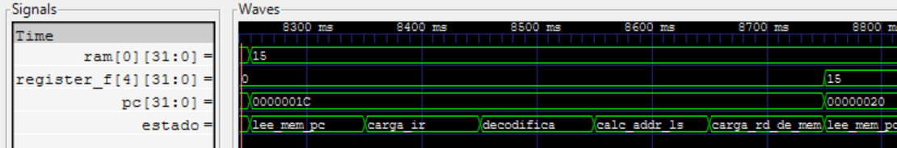

**Imagen 4.3.2** *Formas de onda: transición de estados para instrucción LW*

#### 4.3.2 Integración con periféricos (Top final)

Para demostrar la correcta integración del procesador con los periféricos, se optó por una verificación de mayor complejidad. Se desarrolló un programa en lenguaje C que lee el valor de los interruptores (switches), le suma una constante de 3, codifica el resultado para un display de 7 segmentos y, finalmente, lo escribe en el puerto de los LEDs. Para generar el archivo hexadecimal de inicialización de la memoria, se empleó un compilador cruzado (cross-compiler) de C a RISC-V.

Además, el comportamiento del sistema se comprobó mediante un banco de pruebas (testbench) automatizado. En el caso de prueba principal, se inyectó el valor 11 (decimal) en los switches, y el testbench verificó mediante aserciones que la salida en los LEDs coincidiera con la codificación en 7 segmentos del número 14 (la letra 'E', operando en hexadecimal).


``` vhdl
evaluacion: process
begin
    wait until rising_edge(clk);
    wait for 5000 * periodo;
    report "Valor ingresado en los switches: " & to_string(switches);
    report "Valor mostrado en los LEDs: " & to_string(leds);
    assert leds = "01111001" -- Espera el numero 14 en el display de 7 segmentos
        report "Error: El valor de los LEDs no coincide con el esperado: 01111001"
        severity error;
    if leds = "01111001" then
        report "Test completado exitosamente.";
    end if;
    finish;
end process;
```
Posteriormente, se fue variando los estímulos de entrada y comprobado el correcto funcionamiento en cada caso.

Como se observa en la Imagen 4.3.3 (correspondiente al caso detallado previamente), la prueba confirma el correcto funcionamiento de toda la arquitectura en conjunto: el código compilado, la gestión del controlador de entrada/salida (GPIO), el enrutamiento de las direcciones base en el Crossbar y la ejecución de la CPU.

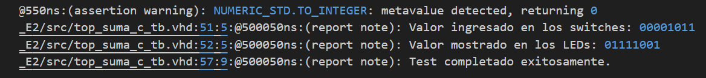

**Imagen 4.3.3** *Resultados del TestBench automático*

Finalmente, el sistema fue implementado físicamente en la placa FPGA. Se comprobó empíricamente que, al accionar los switches, el display de 7 segmentos reaccionaba en tiempo real mostrando el resultado de la suma codificada.

#### 4.3.3 Prueba integradora final. Juego interactivo: "Aprender binario"

Para poner a prueba el microcontrolador desarrollado de manera integral, se creó un juego interactivo en lenguaje C. La dinámica del mismo consiste en lo siguiente:

- Estado de espera: El display muestra un guion (LED intermedio).

- Generación: Al accionar el switch 6, el procesador genera y muestra un número hexadecimal aleatorio (del 0 al F).

- Ingreso de datos: Utilizando los primeros 4 switches (0, 1, 2 y 3), el usuario debe ingresar la traducción exacta de dicho dígito a formato binario.

- Confirmación: Se acciona el switch 7 para indicar que se ha ingresado el intento.

- Acierto: Si la respuesta es correcta, se encienden todos los LEDs del display (parpadeando 3 veces). El panel vuelve a mostrar el guion y espera a que se solicite un nuevo número.

- Error: Si la respuesta es incorrecta, se muestra la letra 'E' de error (parpadeando 3 veces). Luego, el panel vuelve a mostrar el número objetivo hasta que sea adivinado correctamente.

- Puntaje: Adicionalmente, al accionar el switch 5, el display revela el conteo de victorias obtenidas hasta el momento.

Para el desarrollo de la lógica de software de esta aplicación, específicamente en la implementación del algoritmo generador de números pseudoaleatorios, se utilizó asistencia de Inteligencia Artificial (Gemini).

Previo a cargar en la FPGA, se realizó una simulación del código compilado. Para la misma, el número aleatorio mostrado siempre es A (10). En la **Imagen 4.3.4** se puede ver el guion en leds al inicio, al accionar sw6 muestra el numero aleatorio (A), con los switches 0123 escribe A, acciona sw7 y el display realiza la animación de festejo. Luego se simuló el error y el conteo de victorias. En la  **Imagen 4.3.5** se observa que realiza la misma secuencia ingresando B, y el display realiza la animación de error. Unos ciclos después acciona sw5 y el display muestra 1, la victoria obtenida anteriormente.

Finalmente, el código compilado fue integrado a la memoria del diseño y sintetizado en la placa EDU-CIAA-FPGA. Se verificó exitosamente que el juego se ejecuta a la perfección, leyendo las entradas físicas del usuario y reaccionando en el display en tiempo real, validando de forma empírica y absoluta el diseño del microcontrolador.

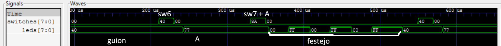

**Imagen 4.3.4** *Formas de onda: numero correcto*

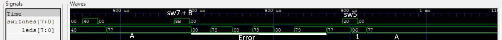

**Imagen 4.3.5** *Formas de onda: numero incorrecto*


---
<div style="page-break-after: always;"></div>

## 5. CONCLUSIONES

El desarrollo del presente trabajo ha permitido adquirir los conceptos fundamentales de arquitectura y microarquitectura de computadoras, con énfasis en el estándar abierto RISC-V y su conjunto básico de instrucciones RV32I. La implementación práctica afianzó el entendimiento del funcionamiento interno de una topología multiciclo. Asimismo, se pudieron poner en práctica las habilidades de diseño digital mediante la descripción de hardware en VHDL, abarcando desde el modelado de Máquinas de Estados Finitos (FSM) hasta la validación del sistema mediante el análisis de formas de onda y la creación de bancos de pruebas automáticos.

Finalmente, cabe destacar la incorporación de herramientas basadas en Inteligencia Artificial (IA) como asistencia técnica durante el ciclo de desarrollo, empleadas metódicamente para la depuración de errores. El dominio y la integración de estas tecnologías emergentes representa una competencia cada vez más indispensable, demostrando que su uso analítico e inteligente no solo agiliza los tiempos de desarrollo, sino que minimiza fallos y potencia la calidad del diseño final.

---
<div style="page-break-after: always;"></div>

## 6. REFERENCIAS

- Harris, D. M., & Harris, S. L. (2019). _Digital design and computer architecture_, RISC-V edition. Morgan Kaufmann.